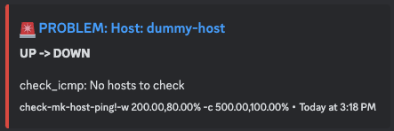
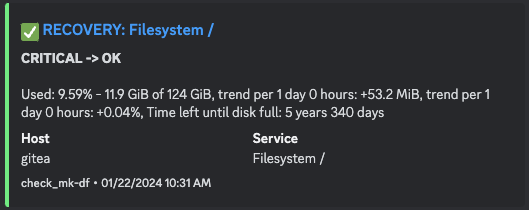
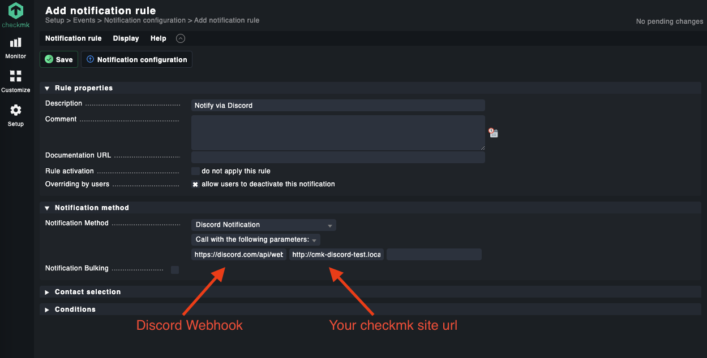

# cmk_discord - Checkmk Discord Notifications

[](https://github.com/fschlag/cmk_discord/releases)


Discord notification plugin for Checkmk monitoring platform.

:warning: _Disclaimer: This is not an official plugin of Checkmk! It's a side project I've developed for my homelab
notifications._

:clap: inspired by the Discord notification plugin of [n00rm](https://github.com/n00rm) that was created as a GitHub
gist a while ago: https://gist.github.com/n00rm/32f1334b1dd2efc40122fee36551ef17
_(unfortunately only as a gist so I couldn't extend it via PR)_

## Features

* Colorized mesage to highlight alert state (incl. emoji :sparkles:)
* Supports all current notification types
    * :rotating_light: `PROBLEM`
    * :white_check_mark: `RECOVERY`
    * :ballot_box_with_check: `ACKNOWLEDGEMENT`
    * :interrobang: `FLAPPINGSTART`
    * :white_check_mark: `FLAPPINGSTOP`
    * :alarm_clock: `DOWNTIMESTART`
    * :white_check_mark: `DOWNTIMEEND`
    * :ballot_box_with_check: `DOWNTIMECANCELLED`
* Service: Includes service description details
* Supports comments (e.g. for acknowledgements or downtimes)
* Link to failed service/host

## Examples




## Usage

* Download the [latest release](https://github.com/fschlag/cmk_discord/releases)
* On your Checkmk server, login to the instance you want to install the plugin (`sudo su - <instance name>`)
* Copy `cmk_discord.py` to `~/local/share/check_mk/notifications`
* In your Checkmk ui, go to Setup --> Notifications --> Add rule
    * As "Notification Method" select "Discord Notification"
    * **First parameter** should be the Discord Webhook URL (mandatory)
    * **Second parameter** (optional) URL to your checkmk instance. This is needed for links to the alerting
      service/host. (check known limitations below)



### Known limitations

**Site URL needs to be a FQDN**

If you see an error like

```text
Unexpected response when calling webhook url https://discord.com/xyz 400. Response body: {"embeds": ["0"]}
```

This probably means that your site URL (the second parameters you've setup) isn't a FQDN (full-qualified-domain-name).
Something like `http://checkmkhost/my_monitoring` won't work since "checkmkhost" is not a FQDN.

Instead using a FQDN `https://checkmkhost.mycompany.com/my_monitoring` (where "my_monitoring" is your site name)
